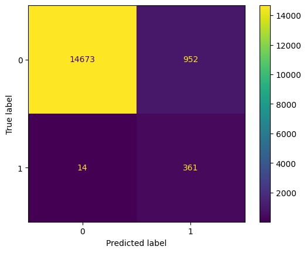

# Desafio-Bix

#### Nome: Getúlio Rodrigues Silva

Desafio técnico para Cientista de Dados Junior Bix Technology

1.	What steps would you take to solve this problem? Please describe as completely and clearly as possible all the steps that you see as essential for solving the problem.

Usando metodologia CRISP-DM, fiz um estudo minucioso para tentar solucionar o problema, os passos são descritos com detalhes no arquivo main.ipynb.
De forma geral a metodologia CRISP-DM aborda 5 passos essenciais.
* Entendimento do negócio
* Entendimento dos dados
* Preparação dos dados
* Modelagem
* Avaliação
* Deployment

2.	Which technical data science metric would you use to solve this challenge? Ex: absolute error, rmse, etc. 

Como métrica de avaliação foi usado o Precisão, Recall e F1 Score, pois, o modelo apresenta dados muito desbalanceados. F1 Score analisa juntamente a precisão e o Recall para avaliar os modelos de Machine Learning.
Sendo assim, analisar acurácia para a classificação dos dados não é uma técnica proveitosa. 

3.	Which business metric  would you use to solve the challenge?

Usando as métricas de ciência de dados para avaliar os modelos, eu tentaria reduzir o custo do ano atual em decorrência dos anos anteriores. Os KPIs de uma companhia podem variar de acordo com essas métricas e se assim conseguirmos otimizar esses valores, o valor do negócio aumenta concomitantemente. Sendo assim, usar as características dos dados para tentar prever quais caminhões, porque, e quando estes apresentam falhas nos sistemas de ar para reduzir a taxa de manutenções corretivas.

4.	How do technical metrics relate to the business metrics?

As métricas técnicas de acurácia, precisão, recall e F-Score influenciam diretamente com os indicadores, que podem aumentar ou diminiur. Se os modelos conseguem acertar com clareza as classes dos dados, consequentemente os valores de negócio aumentam.

5.	What types of analyzes would you like to perform on the customer database?

Análises para explicabilidade de dados. Os dados muito desbalanceados e com valores faltantes muitas vezes não são necessários. Podendo assim ser eliminados para reduzir o volume e tornar mais clara sua análise.

6.	What techniques would you use to reduce the dimensionality of the problem? 

Utilizando Análise de Componentes Principais (PCA) ou até mesmo Rede Neural Autoencoder.

7.	What techniques would you use to select variables for your predictive model?

8.	What predictive models would you use or test for this problem? Please indicate at least 3.

Para predição utilizaria os modelos: K-Nearest Neighbours, Random Forest e XG-Boost

9.	How would you rate which of the trained models is the best?

Utilizando uma matriz de confusão e avaliação dos scores de Precisão, Recall e F-Score. O modelot XGBoost teve melhores resultados nas previsões, por possuir F-Score maior que os outros modelos.

10.	How would you explain the result of your model? Is it possible to know which variables are most important?

O modelo utilizando Random Forest obeteve uma menor previsão de custo. Isso ocorre pois o modelo XGBoost obteve maior quantidade de Falsos Negativos produzindo mais custo. 

O modelo XGBoost obteve melhores resultados com F1-Score de 0.82 para treinamento, 0.84 para teste. 

11.	How would you assess the financial impact of the proposed model?

Fazendo calculos utilizando a matriz de confusão: 
Seguindo a referência para o modelo XGBoost sem redução de dimensionalidade. 

* Se o caminhão é mandado para manutenção e não tem defeito no sistema de ventilação. o custo é de $10. -> Falso Positivo
* Se o caminhão é mandado para manutenção e possui defeito no sistema de ventilação. O custo é de $25. -> Verdadeiro Positivo
* Se o caminhão não é mandado para a manutenção e possui defeito. O custo é $500 devido manutenção corretiva. -> Falso Negativo

Custo previsto utilizando modelo Random Forest.

(952 * 10)+(361 * 25)+(14 * 500) = 25545

12.	What techniques would you use to perform the hyperparameter optimization of the chosen model?
13.	What risks or precautions would you present to the customer before putting this model into production?
14.	If your predictive model is approved, how would you put it into production?
15.	If the model is in production, how would you monitor it?
16.	If the model is in production, how would you know when to retrain it?

